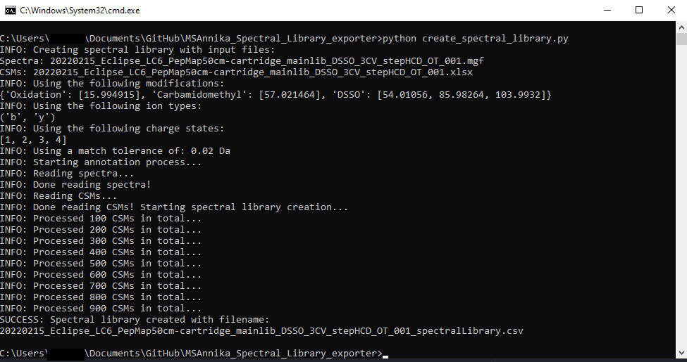
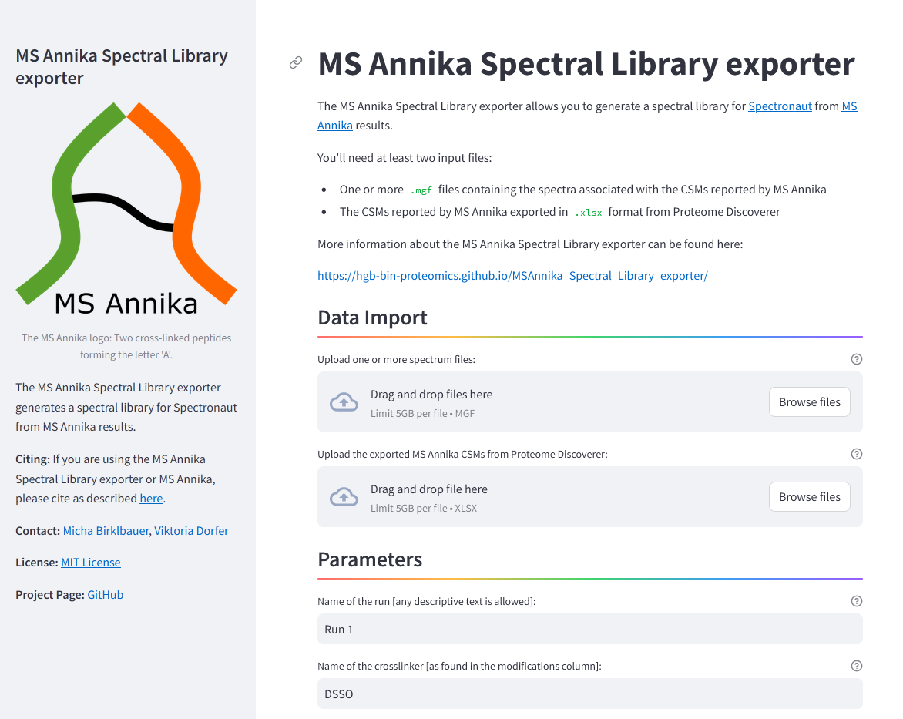
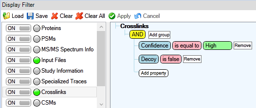

# MS Annika Spectral Library exporter

Generate a spectral library for [Spectronaut](https://biognosys.com/software/spectronaut/) from [MS Annika](https://github.com/hgb-bin-proteomics/MSAnnika) results.



## Usage

- Install python 3.7+: [https://www.python.org/downloads/](https://www.python.org/downloads/)
- Install requirements: `pip install -r requirements.txt`
- Export MS Annika CSMs from Proteome Discoverer to Microsoft Excel format. Filter out decoys beforehand and filter for high-confidence CSMs (see below).
- Convert any RAW files to *.mgf format.
- Set your desired parameters in `config.py` (see below).
- Run `python create_spectral_library.py`.
- If the script successfully finishes, the spectral library should be generated with the extension `_spectralLibrary.csv`, additionally decoy libraries are generated with the extensions
  `_spectralLibraryDECOY_DD.csv`, `_spectralLibraryDECOY_DT.csv`, and `_spectralLibraryDECOY_TD.csv` where `DD` denotes decoy-decoy crosslinks, `DT` denotes decoy-target crosslinks etc. Decoys are
  generated by the reverse strategy as described by Zhang et al. here: [https://doi.org/10.1021/acs.jproteome.7b00614](https://doi.org/10.1021/acs.jproteome.7b00614).

## GUI



**Important: The GUI currently only is supported up to version 1.1.6!**

Alternatively to the commandline-based python script, a GUI is also available via [Docker](https://www.docker.com/):
- After [installing Docker](https://docs.docker.com/engine/install/) [[Quick Guide here](https://github.com/michabirklbauer/PIA/blob/master/DOCKER.md)] run the following command:
  ```
  docker run -p 8501:8501 michabirklbauer/spectrallibraryexporter
  ```
- Navigate to `localhost:8501` in your browser. You should see the MS Annika Spectral Library exporter GUI!

If you don't have/want to install Docker you can also run the GUI natively using the following commands:
- Open a terminal inside `MSAnnika_Spectral_Library_exporter`.
- Enter `cp gui/streamlit_app.py .`.
- Enter `cp gui/streamlit_util.py .`.
- Enter `pip install streamlit`.
- Enter `streamlit run streamlit_app.py --server.maxUploadSize 5000`.
- Navigate to `localhost:8501` in your browser. You should see the MS Annika Spectral Library exporter GUI!

## Exporting MS Annika results to Microsoft Excel

The script uses a Micrsoft Excel files as input, for that MS Annika results need to be exported from Proteome Discoverer. It is recommended to first filter results according to your needs, e.g. filter for high-confidence CSMs and filter out decoy CSMs as depicted below.



Results can then be exported by selecting `File > Export > To Microsoft Excel… > Level 1: CSMs > Export` in Proteome Discoverer.

## Parameters

The following parameters need to be adjusted for your needs in the `config.py` file:

```python
##### PARAMETERS #####

# name of the mgf file containing the MS2 spectra
SPECTRA_FILE = ["20220215_Eclipse_LC6_PepMap50cm-cartridge_mainlib_DSSO_3CV_stepHCD_OT_001.mgf"]
# name of the CSM file exported from Proteome Discoverer
CSMS_FILE = "20220215_Eclipse_LC6_PepMap50cm-cartridge_mainlib_DSSO_3CV_stepHCD_OT_001.xlsx"
# name of the experiment / run (any descriptive text is allowed)
RUN_NAME = "20220215_Eclipse_LC6_PepMap50cm-cartridge_mainlib_DSSO_3CV_stepHCD_OT_001-(1)"
# name of the crosslink modification
CROSSLINKER = "DSSO"
# possible modifications and their monoisotopic masses
MODIFICATIONS = \
    {"Oxidation": [15.994915],
     "Carbamidomethyl": [57.021464],
     "DSSO": [54.01056, 85.98264, 103.99320]}
# expected ion types (any of a, b, c, x, y, z)
ION_TYPES = ("b", "y")
# maximum expected charge of fragment ions
MAX_CHARGE = 4
# tolerance for matching peaks
MATCH_TOLERANCE = 0.02
# parameters for calculating iRT
iRT_PARAMS = {"iRT_m": 1.3066, "iRT_t": 29.502}
```

In case you have more than one `SPECTRA_FILE` you can specify that like this:

```python
##### PARAMETERS #####

# name of the mgf file containing the MS2 spectra
SPECTRA_FILE = ["20220215_Eclipse_LC6_PepMap50cm-cartridge_mainlib_DSSO_3CV_stepHCD_OT_001.mgf",
                "20220215_Eclipse_LC6_PepMap50cm-cartridge_mainlib_DSSO_3CV_stepHCD_OT_002.mgf"]
# name of the CSM file exported from Proteome Discoverer
CSMS_FILE = "20220215_Eclipse_LC6_PepMap50cm-cartridge_mainlib_DSSO_3CV_stepHCD_OT_001.xlsx"
# name of the experiment / run (any descriptive text is allowed)
RUN_NAME = "20220215_Eclipse_LC6_PepMap50cm-cartridge_mainlib_DSSO_3CV_stepHCD_OT_001-(1)"
# name of the crosslink modification
CROSSLINKER = "DSSO"
# possible modifications and their monoisotopic masses
MODIFICATIONS = \
    {"Oxidation": [15.994915],
     "Carbamidomethyl": [57.021464],
     "DSSO": [54.01056, 85.98264, 103.99320]}
# expected ion types (any of a, b, c, x, y, z)
ION_TYPES = ("b", "y")
# maximum expected charge of fragment ions
MAX_CHARGE = 4
# tolerance for matching peaks
MATCH_TOLERANCE = 0.02
# parameters for calculating iRT
iRT_PARAMS = {"iRT_m": 1.3066, "iRT_t": 29.502}
```

## Known Issues

[List of known issues](https://github.com/hgb-bin-proteomics/MSAnnika_Spectral_Library_exporter/issues)

## Citing

If you are using the MS Annika Spectral Library exporter script please cite:
```
MS Annika 2.0 Identifies Cross-Linked Peptides in MS2–MS3-Based Workflows at High Sensitivity and Specificity
Micha J. Birklbauer, Manuel Matzinger, Fränze Müller, Karl Mechtler, and Viktoria Dorfer
Journal of Proteome Research 2023 22 (9), 3009-3021
DOI: 10.1021/acs.jproteome.3c00325
```

If you are using MS Annika please cite:
```
MS Annika 2.0 Identifies Cross-Linked Peptides in MS2–MS3-Based Workflows at High Sensitivity and Specificity
Micha J. Birklbauer, Manuel Matzinger, Fränze Müller, Karl Mechtler, and Viktoria Dorfer
Journal of Proteome Research 2023 22 (9), 3009-3021
DOI: 10.1021/acs.jproteome.3c00325
```
or
```
MS Annika: A New Cross-Linking Search Engine
Georg J. Pirklbauer, Christian E. Stieger, Manuel Matzinger, Stephan Winkler, Karl Mechtler, and Viktoria Dorfer
Journal of Proteome Research 2021 20 (5), 2560-2569
DOI: 10.1021/acs.jproteome.0c01000
```

## License

- [MIT](https://github.com/hgb-bin-proteomics/MSAnnika_Spectral_Library_exporter/blob/master/LICENSE)

## Contact

- [micha.birklbauer@fh-hagenberg.at](mailto:micha.birklbauer@fh-hagenberg.at)
