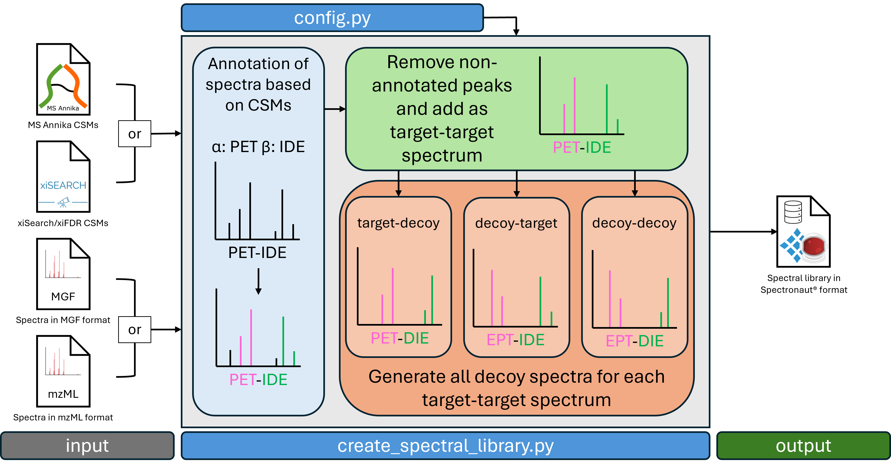
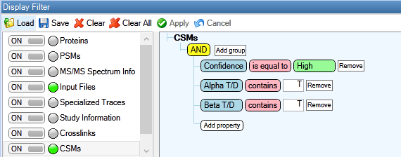

# MS Annika Spectral Library exporter

Generate a spectral library for [Spectronaut](https://biognosys.com/software/spectronaut/) from [MS Annika](https://github.com/hgb-bin-proteomics/MSAnnika) results.



## Requirements

- You need to install python: [https://www.python.org/downloads/](https://www.python.org/downloads/)
  - Alternatively you can also use [uv](https://docs.astral.sh/uv/getting-started/installation/).
- We recommend at least 32 GB of memory for larger MS files!

> [!NOTE]
> Pinned python and package versions are available in the `uv.lock` file!

## Usage

> [!IMPORTANT]
> We also support [uv](https://docs.astral.sh/uv/) via inline script metadata.
> To run with uv simply replace `python` with `uv run`, e.g. `uv run create_spectral_library.py`!

- Install python 3.7+: [https://www.python.org/downloads/](https://www.python.org/downloads/)
- Install requirements: `pip install -r requirements.txt`
- Export MS Annika CSMs from Proteome Discoverer to Microsoft Excel format. Filter out decoys beforehand and filter for high-confidence CSMs (see below).
- Convert any RAW files to *.mgf or *.mzML format, e.g. using [ThermoRawFileParser](https://github.com/compomics/ThermoRawFileParser).
- Set your desired parameters in `config.py` (see below).
- Run `python create_spectral_library.py`.
- If the script successfully finishes, the target spectral library should be generated with the extension `_spectralLibrary.csv`.
- Additionally decoy libraries are generated with the extensions:
  - `_spectralLibraryDECOY_DD.csv`: library with decoy-decoy crosslinks.
  - `_spectralLibraryDECOY_DT.csv`: library with decoy-target crosslinks.
  - `_spectralLibraryDECOY_TD.csv`: library with target-decoy crosslinks.
  - Decoys are generated by the reverse strategy as described by Zhang et al. here: [https://doi.org/10.1021/acs.jproteome.7b00614](https://doi.org/10.1021/acs.jproteome.7b00614).
- The full spectral library including all target and decoy annotations is created with extension `_spectralLibraryFULL.csv`.
  - This spectral library should be used with [Spectronaut](https://biognosys.com/software/spectronaut/)!

## Example

Here is a minimal example (we are using [uv](https://docs.astral.sh/uv/) here):

- You can download some example data from [here](http://u.pc.cd/omH).
- Clone this repository:
  ```bash
  git clone https://github.com/hgb-bin-proteomics/MSAnnika_Spectral_Library_exporter.git 
  ```
- Extract the example data into the `MSAnnika_Spectral_Library_exporter` folder.
  - **Overwrite any files if prompted!**
- Go into the `MSAnnika_Spectral_Library_exporter` folder.
- The folder should contain the example files:
  - `config.py`
  - `XLpeplib_Beveridge_QEx-HFX_DSS_R2.mzML`
  - `XLpeplib_Beveridge_QEx-HFX_DSS_R2_CSMs.xlsx`
- Now run the spectral library creation script with [uv](https://docs.astral.sh/uv/):
  ```bash
  uv run create_spectral_library.py
  ```
- The script should run for about one minute and you should see output like this:
  <details><summary>Expand for output!</summary>
  ```text
  INFO: Spectral library creation started at 2026-05-12 15:34:30.616870.
  INFO: Creating spectral library with input files:
  Spectra:
  XLpeplib_Beveridge_QEx-HFX_DSS_R2.mzML
  CSMs: XLpeplib_Beveridge_QEx-HFX_DSS_R2_CSMs.xlsx
  INFO: Using the following modifications:
  {'Oxidation': [15.994915], 'Carbamidomethyl': [57.021464], 'DSSO': [54.01056, 85.98264, 103.9932], 'DSS': [138.06808]}
  INFO: Using the following ion types:
  ('b', 'y')
  INFO: Using the following charge states:
  [1, 2, 3, 4]
  INFO: Using a match tolerance of: 0.02 Da
  INFO: Starting annotation process...
  INFO: Reading CSMs...
  INFO: Done reading CSMs! Filtering for unique residue pairs...
  INFO: Done filtering for unique residue pairs!
  INFO: Sorting CSMs...
  INFO: Finished sorting CSMs! Starting spectral library creation...
  INFO: Processing CSMs...:   0%|                                                                                              | 0/382 [00:00<?, ?it/s]Found unseen spectrum file! Trying to read spectrum file...
  Reading mzML file...
  Found 0/10951 spectra without peaks in file XLpeplib_Beveridge_QEx-HFX_DSS_R2.mzML!
  INFO: Read all spectra from file XLpeplib_Beveridge_QEx-HFX_DSS_R2.mzML.
  INFO: Read 1/1 files...
  INFO: Read all spectra files successfully!
  INFO: Processing CSMs...: 100%|████████████████████████████████████████████████████████████████████████████████████| 382/382 [00:14<00:00, 27.15it/s]
  SUCCESS: Spectral library created with filename:
  XLpeplib_Beveridge_QEx-HFX_DSS_R2_CSMs_spectralLibrary.csv
  SUCCESS: Decoy Spectral libraries created with filenames:
  XLpeplib_Beveridge_QEx-HFX_DSS_R2_CSMs_spectralLibraryDECOY_DD.csv
  XLpeplib_Beveridge_QEx-HFX_DSS_R2_CSMs_spectralLibraryDECOY_DT.csv
  XLpeplib_Beveridge_QEx-HFX_DSS_R2_CSMs_spectralLibraryDECOY_TD.csv
  Creating merged library...
  SUCCESS: Merged spectral library created with filename:
  XLpeplib_Beveridge_QEx-HFX_DSS_R2_CSMs_spectralLibraryFULL.csv
  SUCCESS: Spectral library creation finished at 2026-05-12 15:34:45.473506.
  ```
  </details>
- You should see the following files created:
  - `XLpeplib_Beveridge_QEx-HFX_DSS_R2_CSMs_spectralLibrary.csv` ➡️ Target(-Target) spectral library
  - `XLpeplib_Beveridge_QEx-HFX_DSS_R2_CSMs_spectralLibraryDECOY_DD.csv` ➡️ Decoy-Decoy spectral library
  - `XLpeplib_Beveridge_QEx-HFX_DSS_R2_CSMs_spectralLibraryDECOY_DT.csv` ➡️ Decoy-Target spectral library
  - `XLpeplib_Beveridge_QEx-HFX_DSS_R2_CSMs_spectralLibraryDECOY_TD.csv` ➡️ Target-Decoy spectral library
  - `XLpeplib_Beveridge_QEx-HFX_DSS_R2_CSMs_spectralLibraryFULL.csv` ➡️ Full spectral library
- The full library can now be used in Spectronaut!

## Usage with xiSearch + xiFDR

Starting with version [1.4.4](https://github.com/hgb-bin-proteomics/MSAnnika_Spectral_Library_exporter/releases/tag/v1.4.4) this script also supports input from
[xiSearch](https://www.rappsilberlab.org/software/xisearch/) with [xiFDR](https://www.rappsilberlab.org/software/xifdr/). Simply use the validated CSMs file from
xiFDR (e.g. usually ending with extension `CSM_xiFDR*.*.*.csv` where `*` denotes the xiFDR version) as input for the `CSMS_FILE` parameter in the `config.py` file!

## Exporting MS Annika results to Microsoft Excel

The script uses a Micrsoft Excel files as input, for that MS Annika results need to be exported from Proteome Discoverer. It is recommended to first filter results according to your needs, e.g. filter for high-confidence CSMs and filter out decoy CSMs as depicted below.



Results can then be exported by selecting `File > Export > To Microsoft Excel… > Level 1: CSMs > Export` in Proteome Discoverer.

## Parameters

The following parameters need to be adjusted for your needs in the `config.py` file:

```python
##### PARAMETERS #####

# name of the mgf or mzML file(s) containing the MS2 spectra
SPECTRA_FILE = ["20220215_Eclipse_LC6_PepMap50cm-cartridge_mainlib_DSSO_3CV_stepHCD_OT_001.mgf"]
# name of the CSM file exported from Proteome Discoverer
CSMS_FILE = "20220215_Eclipse_LC6_PepMap50cm-cartridge_mainlib_DSSO_3CV_stepHCD_OT_001.xlsx"
# name of the experiment / run (any descriptive text is allowed)
RUN_NAME = "20220215_Eclipse_LC6_PepMap50cm-cartridge_mainlib_DSSO_3CV_stepHCD_OT_001-(1)"
# name of the sample organism that should be reported in the spectral library
ORGANISM = "Homo sapiens"
# name of the crosslink modification
CROSSLINKER = "DSSO"
# possible modifications and their monoisotopic masses
MODIFICATIONS = \
    {"Oxidation": [15.994915],
     "Carbamidomethyl": [57.021464],
     "DSSO": [54.01056, 85.98264, 103.99320]}
# modifications mapping for xiFDR sequences
MODIFICATIONS_XI = \
    {"Ccm": ["C", "Carbamidomethyl"],
     "Mox": ["M", "Oxidation"]}
# expected ion types (any of a, b, c, x, y, z)
ION_TYPES = ("b", "y")
# maximum expected charge of fragment ions
MAX_CHARGE = 4
# tolerance for matching peaks
MATCH_TOLERANCE = 0.02
# parameters for calculating iRT
iRT_PARAMS = {"iRT_m": 1.3066, "iRT_t": 29.502}
# regex pattern used for parsing scan number from the spectrum title
PARSER_PATTERN = "\\.\\d+\\."
# only take the best CSM per unique peptidoform and charge (True) or not (False)
GROUP_PRECURSORS = True
# raise an error if spectra do not contain FAIMS compensation voltage information
ERROR_ON_NO_FAIMS = True
```

In case you have more than one `SPECTRA_FILE` you can specify that like this:

```python
##### PARAMETERS #####

# name of the mgf or mzML file(s) containing the MS2 spectra
SPECTRA_FILE = ["20220215_Eclipse_LC6_PepMap50cm-cartridge_mainlib_DSSO_3CV_stepHCD_OT_001.mzML",
                "20220215_Eclipse_LC6_PepMap50cm-cartridge_mainlib_DSSO_3CV_stepHCD_OT_002.mzML"]
# name of the CSM file exported from Proteome Discoverer
## <code omitted> ##
```

### About `MODIFICATIONS` and `MODIFICATIONS_XI`

The `MODIFICATIONS` parameter needs to contain the exact names (as displayed in the MS Annika result file) and delta monoisotopic
masses of all post-translational-modifications identified in the result file. This includes the crosslinker modification that is
given in the `CROSSLINKER` parameter (and that was used in the search).

For cleavable crosslinkers the mass of all stubs should be given, for example for DSSO (also given in the config file):
- Alkene stub: `54.01056`
- Thiol stub: `85.98264`
- Sulfenic acid stub (thiol + H2O): `103.99320`

For non-cleavable crosslinkers the complete delta mass should be given, for example:
- DSS: `138.06808`

The `MODIFICATIONS_XI` parameter is similar and needs to map modification symbols of the xiSearch/xiFDR output to their amino acids
and modification names. Modification names need to match the names in the `MODIFICATIONS` parameter because delta masses are
resolved using the `MODIFICATIONS` parameter!

## Post processing

For post processing and validation of Spectronaut result files, please read further [here](POSTPROCESSING.md).

## Rescoring

We also explored rescoring of the results with [Mokapot](https://github.com/wfondrie/mokapot).
You can find out more about that in the `/rescoring` git submodule or [here](https://github.com/hgb-bin-proteomics/MSAnnika_Spectral_Library_exporter_rescoring).

## Known Issues

[List of known issues](https://github.com/hgb-bin-proteomics/MSAnnika_Spectral_Library_exporter/issues)

## Citing

Manuscript in preparation.

## License

- [MIT](https://github.com/hgb-bin-proteomics/MSAnnika_Spectral_Library_exporter/blob/master/LICENSE)

## Contact

- [micha.birklbauer@fh-hagenberg.at](mailto:micha.birklbauer@fh-hagenberg.at)
