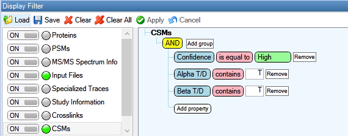

# MS Annika Spectral Library exporter

Generate a spectral library for [Spectronaut](https://biognosys.com/software/spectronaut/) from [MS Annika](https://github.com/hgb-bin-proteomics/MSAnnika) results.


## Usage

- Install python 3.7+: [https://www.python.org/downloads/](https://www.python.org/downloads/)
- Install requirements: `pip install -r requirements.txt`
- Export MS Annika CSMs from Proteome Discoverer to Microsoft Excel format. Filter out decoys beforehand and filter for high-confidence CSMs (see below).
- Convert any RAW files to *.mgf or *.mzML format, e.g. using [ThermoRawFileParser](https://github.com/compomics/ThermoRawFileParser).
- Set your desired parameters in `config.py` (see below).
- Run `python create_spectral_library.py`.
- If the script successfully finishes, the target spectral library should be generated with the extension `_spectralLibrary.csv`.
- Additionally decoy libraries are generated with the extensions:
  - `_spectralLibraryDECOY_DD.csv`: library with decoy-decoy crosslinks.
  - `_spectralLibraryDECOY_DT.csv`: library with decoy-target crosslinks.
  - `_spectralLibraryDECOY_TD.csv`: library with target-decoy crosslinks.
  - Decoys are generated by the reverse strategy as described by Zhang et al. here: [https://doi.org/10.1021/acs.jproteome.7b00614](https://doi.org/10.1021/acs.jproteome.7b00614).
- The full spectral library including all target and decoy annotations is created with extension `_spectralLibraryFULL.csv`.
  - This spectral library should be used with [Spectronaut](https://biognosys.com/software/spectronaut/)!

## Usage with xiSearch + xiFDR

Starting with version [1.4.4](https://github.com/hgb-bin-proteomics/MSAnnika_Spectral_Library_exporter/releases/tag/v1.4.4) this script also supports input from
[xiSearch](https://www.rappsilberlab.org/software/xisearch/) with [xiFDR](https://www.rappsilberlab.org/software/xifdr/). Simply use the validated CSMs file from
xiFDR (e.g. usually ending with extension `CSM_xiFDR*.*.*.csv` where `*` denotes the xiFDR version) as input for the `CSMS_FILE` parameter in the `config.py` file!

## Exporting MS Annika results to Microsoft Excel

The script uses a Micrsoft Excel files as input, for that MS Annika results need to be exported from Proteome Discoverer. It is recommended to first filter results according to your needs, e.g. filter for high-confidence CSMs and filter out decoy CSMs as depicted below.



Results can then be exported by selecting `File > Export > To Microsoft Excel… > Level 1: CSMs > Export` in Proteome Discoverer.

## Parameters

The following parameters need to be adjusted for your needs in the `config.py` file:

```python
##### PARAMETERS #####

# name of the mgf or mzML file(s) containing the MS2 spectra
SPECTRA_FILE = ["20220215_Eclipse_LC6_PepMap50cm-cartridge_mainlib_DSSO_3CV_stepHCD_OT_001.mgf"]
# you can process multiple files like this:
# SPECTRA_FILE = ["20220215_Eclipse_LC6_PepMap50cm-cartridge_mainlib_DSSO_3CV_stepHCD_OT_001.mgf", "20220215_Eclipse_LC6_PepMap50cm-cartridge_mainlib_DSSO_3CV_stepHCD_OT_002.mgf"]
# name of the CSM file exported from Proteome Discoverer
CSMS_FILE = "20220215_Eclipse_LC6_PepMap50cm-cartridge_mainlib_DSSO_3CV_stepHCD_OT_001.xlsx"
# name of the experiment / run (any descriptive text is allowed)
RUN_NAME = "20220215_Eclipse_LC6_PepMap50cm-cartridge_mainlib_DSSO_3CV_stepHCD_OT_001-(1)"
# name of the sample organism that should be reported in the spectral library
ORGANISM = "Homo sapiens"
# name of the crosslink modification
CROSSLINKER = "DSSO"
# possible modifications and their monoisotopic masses
MODIFICATIONS = \
    {"Oxidation": [15.994915],
     "Carbamidomethyl": [57.021464],
     "DSSO": [54.01056, 85.98264, 103.99320]}
# modifications mapping for xiFDR sequences
MODIFICATIONS_XI = \
    {"Ccm": ["C", "Carbamidomethyl"],
     "Mox": ["M", "Oxidation"]}
# expected ion types (any of a, b, c, x, y, z)
ION_TYPES = ("b", "y")
# maximum expected charge of fragment ions
MAX_CHARGE = 4
# tolerance for matching peaks
MATCH_TOLERANCE = 0.02
# parameters for calculating iRT
iRT_PARAMS = {"iRT_m": 1.3066, "iRT_t": 29.502}
# regex pattern used for parsing scan number from the spectrum title
PARSER_PATTERN = "\\.\\d+\\."
```

In case you have more than one `SPECTRA_FILE` you can specify that like this:

```python
##### PARAMETERS #####

# name of the mgf or mzML file(s) containing the MS2 spectra
SPECTRA_FILE = ["20220215_Eclipse_LC6_PepMap50cm-cartridge_mainlib_DSSO_3CV_stepHCD_OT_001.mzML",
                "20220215_Eclipse_LC6_PepMap50cm-cartridge_mainlib_DSSO_3CV_stepHCD_OT_002.mzML"]
# name of the CSM file exported from Proteome Discoverer
## <code omitted> ##
```

## Post processing

For post processing and validation of Spectronaut result files, please read further [here](POSTPROCESSING.md).

## Known Issues

[List of known issues](https://github.com/hgb-bin-proteomics/MSAnnika_Spectral_Library_exporter/issues)

## Citing

If you are using MS Annika please cite as described [here](https://github.com/hgb-bin-proteomics/MSAnnika?tab=readme-ov-file#citing).

## License

- [MIT](https://github.com/hgb-bin-proteomics/MSAnnika_Spectral_Library_exporter/blob/master/LICENSE)

## Contact

- [micha.birklbauer@fh-hagenberg.at](mailto:micha.birklbauer@fh-hagenberg.at)
